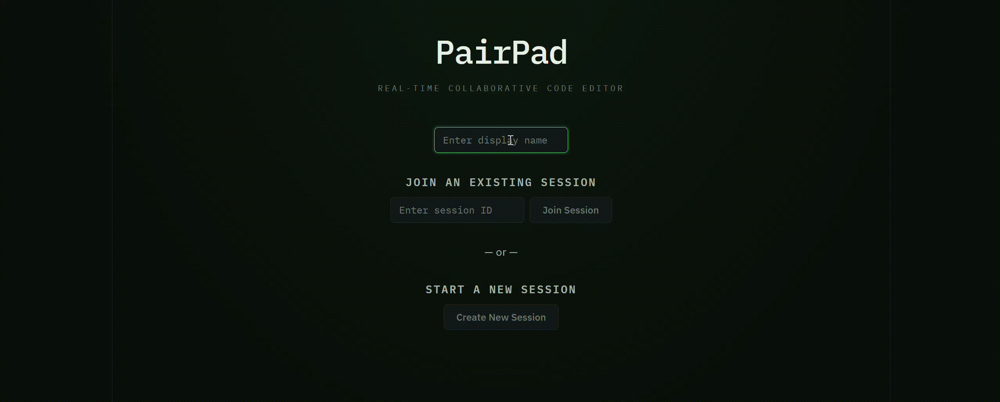
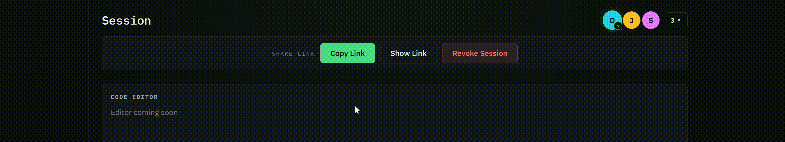

# PairPad

## Project Overview
PairPad is a real-time collaborative coding and whiteboarding platform designed to support pair programming, shared problem‑solving, and interactive learning. The system enables multiple users to edit documents, share cursor positions, execute Python code safely, and collaborate through a synchronized whiteboard — all in real time.  
The goal of this project is to provide a seamless, low‑latency environment that supports both instructional use cases and peer‑to‑peer collaboration.

## Setup / Installation Instructions
These instructions reflect the project in its current, unfinished state and are **subject to change as full implementation is completed**.

### **Prerequisites**
- **Node.js + npm** — required for the React/Vite frontend.
- **Python 3** and **pip** — required for the Flask backend.
- A terminal with the ability to run commands in two separate windows or tabs.

### **1. Clone the Repository**
```bash
git clone <repository-url>
cd PairPad
```

### **2. Set Up the Backend**
Move into the backend folder and create a Python virtual environment.

**Windows (PowerShell):**
```powershell
cd pairpad-backend
python -m venv venv
.\venv\Scripts\activate
```

**macOS / Linux:**
```bash
cd pairpad-backend
python -m venv venv
source venv/bin/activate
```

Install the backend dependencies:
```bash
pip install -r requirements.txt
```

### **3. Set Up the Frontend**
Open a second terminal, return to the project root if needed, and install the frontend dependencies:

```bash
cd pairpad-frontend
npm install
```

## Running the Application
The run steps below are also **subject to change as the remaining application features are fully implemented**.

### **Current State**
At this stage, the application includes:
- A **Flask backend** with health, create session, join session, and revoke session endpoints.
- A **React/Vite frontend** that calls the backend through the Vite `/api` proxy.
- In-progress features for real-time collaboration, whiteboarding, and code execution that are not yet fully implemented.

To run the project successfully right now, start the backend and frontend separately.

### **1. Start the Backend**
From the `pairpad-backend` directory, with the virtual environment activated:

```bash
python app.py
```

The backend will run somewhere like:
```text
http://localhost:5000
```

You can verify it is running by opening:
```text
http://localhost:5000/health
```

### **2. Start the Frontend**
From the `pairpad-frontend` directory:

```bash
npm run dev
```

Vite will print a local development URL, typically:
```text
http://localhost:5173
```

### **3. Use the Application in Its Current Form**
Once both servers are running:
1. Open the frontend URL in your browser.
2. Use the current home page to create a session or join an existing one.
3. Let the frontend send API requests through `/api`, which Vite proxies to the Flask backend on port `5000`.

### **Important Note About the Unfinished State**
Because PairPad is still under active development, some planned functionality may be incomplete, mocked, or subject to change. The setup and run instructions above are intended to help contributors and reviewers launch the project **as it exists today**, but they should be treated as temporary until the full implementation is finished.

---

## Tech Stack Summary

### **Frontend** (Mostly Implemented)
- **React (v18+)** — Component-based UI for real-time interactions, editor rendering, and whiteboard updates.
- **Vitest** — Unit testing for UI logic and component behavior.

### **Backend** (Partially Implemented)
- **Python + Flask** — Session management, API endpoints, and orchestration of backend services.
- **Python Unit Tests (pytest)** — Ensures backend logic correctness and reliability.

### **Real-Time Collaboration** (Work in Progress)
- **SpacetimeDB** — Real-time database and synchronization engine for document state, whiteboard data, and presence.
- **WebSockets (via SpacetimeDB)** — Low-latency communication for collaborative editing.

### **Code Execution** (Work in Progress)
- **Python Sandbox** — Secure, isolated environment for executing user-submitted Python code.

### **Version Control & Deployment** (Ongoing)
- **Git + GitHub** — Branching, pull requests, and collaborative development workflow.
- **Vercel / Railway / Heroku** — Hosting for frontend and backend services with CI/CD integration.

---

## Team Members & Contributions

### **Joe Denk — Product Owner**
Worked primarily on the React frontend and UI elements, ensuring that functionalities were meeting customer needs. 
Focused on providing the backbone, which the rest of the work for Sprint 5 was based on, as the frontend was the first feature finished.

### **Garrett Reihner — Scrum Master**
Organized the team and set out an achievable timeline for Sprint 5 with the end goals of Sprint 6 in mind. 
Did primary development on the backend unit tests and documentation that could keep the team organized.

### **Jonathan Coulter — Developer**
Did the primary development work on the starting Flask skeleton and implementing the starting Session Management 
Classes. Set up the framework that allowed for the creation of robust unit tests.

### **Aidan Smagh — Developer**
Did the primary development work on the frontend unit tests with Vitest, ensuring that the 
logic was correct and all React items were properly implemented.

---

## Frontend Demos





